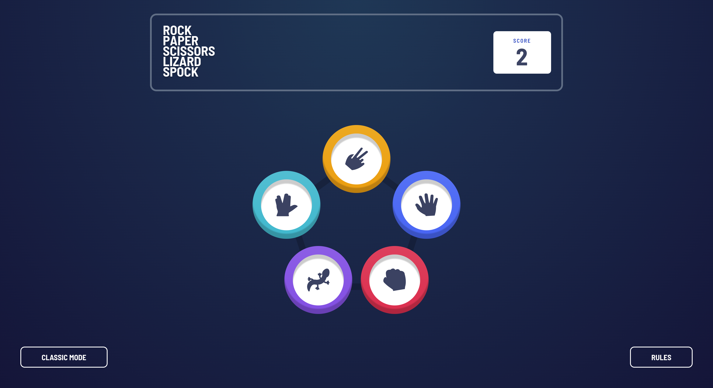

# Frontend Mentor - Rock, Paper, Scissors solution

This is a solution to the [Rock, Paper, Scissors challenge on Frontend Mentor](https://www.frontendmentor.io/challenges/rock-paper-scissors-game-pTgwgvgH). Frontend Mentor challenges help you improve your coding skills by building realistic projects.

## Table of contents

- [Overview](#overview)
  - [The challenge](#the-challenge)
  - [Screenshot](#screenshot)
  - [Links](#links)
- [My process](#my-process)
  - [Built with](#built-with)
  - [Learning & Development](#learning-&-development)
- [Author](#author)

## Overview

### The challenge

Users should be able to:

- View the optimal layout for the game depending on their device's screen size
- Play Rock, Paper, Scissors against the computer
- Maintain the state of the score after refreshing the browser _(optional)_
- **Bonus**: Play Rock, Paper, Scissors, Lizard, Spock against the computer _(optional)_

### Rules

If the player wins, they gain 1 point. If the computer wins, the player loses one point.

#### Original

- Paper beats Rock
- Rock beats Scissors
- Scissors beats Paper

#### Bonus

- Scissors beats Paper
- Paper beats Rock
- Rock beats Lizard
- Lizard beats Spock
- Spock beats Scissors
- Scissors beats Lizard
- Paper beats Spock
- Rock beats Scissors
- Lizard beats Paper
- Spock beats Rock

Not sure what Rock, Paper, Scissors, Lizard, Spock is? [Check out this clip from The Big Bang Theory](https://www.youtube.com/watch?v=iSHPVCBsnLw).

### Screenshot

### Links

- Solution URL: [https://github.com/akshaypatel99/rock-paper-scissors](https://github.com/akshaypatel99/rock-paper-scissors)
- Live Site URL: [https://rock-paper-scissors-react-ts.netlify.app/](https://rock-paper-scissors-react-ts.netlify.app/)

## My process

### Built with

- Semantic HTML5 markup
- CSS custom properties
- Flexbox
- CSS Grid
- Mobile-first workflow
- [React](https://reactjs.org/) - JS library
- TypeScript - language
- Vite - build tool

### Learning & Development

Practicing and reinforcing my knowledge of HTML, CSS, JS, React and TypeScript.

## Author

- Website - [Akshay Patel](https://www.akshaypatel.dev)
- Frontend Mentor - [@akshaypatel99](https://www.frontendmentor.io/profile/akshaypatel99)
- Twitter - [@laidbackak](https://www.twitter.com/laidbackak)
